# ESP32 BLE HID WebSocket Server

```mermaid
flowchart LR;
    A[📱 Client] -->|Send Keystroke via Wi-Fi| B[🤖 ESP32];
    B --> |Control via Bluetooth HID| C[💻 Target Device];
```



This project uses an ESP32 as a BLE HID 

device which can be controlled over a WebSocket client. This project demonstrates Wi-Fi connectivity, WebSockets, and BLE HID (Bluetooth Low Energy Human Interface Device) functionality, including a web server for configuration and monitoring.

https://github.com/user-attachments/assets/ce2d48cc-8cc8-4e53-9c0c-9ea3266aab20

## Hardware Requirements

- ESP32 development board (tested with ESP32 WROOM)
- Computer with PlatformIO installed

## Setup Instructions

1. **Install PlatformIO**
   Make sure you have PlatformIO installed in your IDE (preferably Visual Studio Code).

2. **Clone the repository**
   ```bash
   git clone https://github.com/amoshydra/esp32-ble-hid-websocket-server.git
   cd esp32-ble-hid-websocket-server
   ```

3. **Configure Wi-Fi credentials**
   Copy `src/secrets.h.example` to `src/secrets.h` and fill in your Wi-Fi SSID and password:
   ```cpp
   #define SECRET_SSID "your_wifi_ssid"
   #define SECRET_PASSWORD "your_wifi_password"
   ```

4. **Build the project**
   Use PlatformIO to build the project:
   ```
   pio run
   ```

5. **Upload to ESP32**
   Connect your ESP32 board and upload the firmware using PlatformIO:
   ```
   pio run --target upload
   ```

## Usage

1. Starting the ESP32 board
2. Connect your device via Bluetooth to the ESP32 (default name: "ESP32 HID")
3. Control the keyboard using the provided WebSocket client (www/index.html)


### Starting the ESP32 board
Once uploaded, the ESP32 will start a WebSocket server on `http://<ESP32_IP>:81`. The IP address can be found in the Serial Monitor. The WebSocket server will listens for commands to control your device via Bluetooth HID.

### Connect your device

Connect your device via Bluetooth to the ESP32 (default name: "ESP32 HID"). The ESP32 will respond with a list of available commands.

### Control the keyboard using a WebSocket client

A simple WebSocket client can found in the `www` folder, which can be used to send commands to the WebSocket server.

```bash
cd www
python3 -m http.server 8000
```

Then navigate to `http://localhost:8000/target=<ESP32_IP>:81` in your web browser.

Make sure the status says connected, then start typing via the virtual keyboard.


## Project Structure

```
.
├── .gitignore
├── CMakeLists.txt
├── platformio.ini
├── src/
│   ├── CMakeLists.txt
│   ├── main.cpp
│   └── secrets.h.example
└── www/
    └── index.html
```

- `src/`: Main source code directory with the ESP32 application.
- `www/`: Web content served by the web server.

## Dependencies

The project uses the following libraries:

- [ESP32 BLE Keyboard](https://github.com/t-vk/ESP32-BLE-Keyboard) for Bluetooth HID functionality
- [WebSockets](https://github.com/Links2004/WebSockets) library for WebSocket communication
